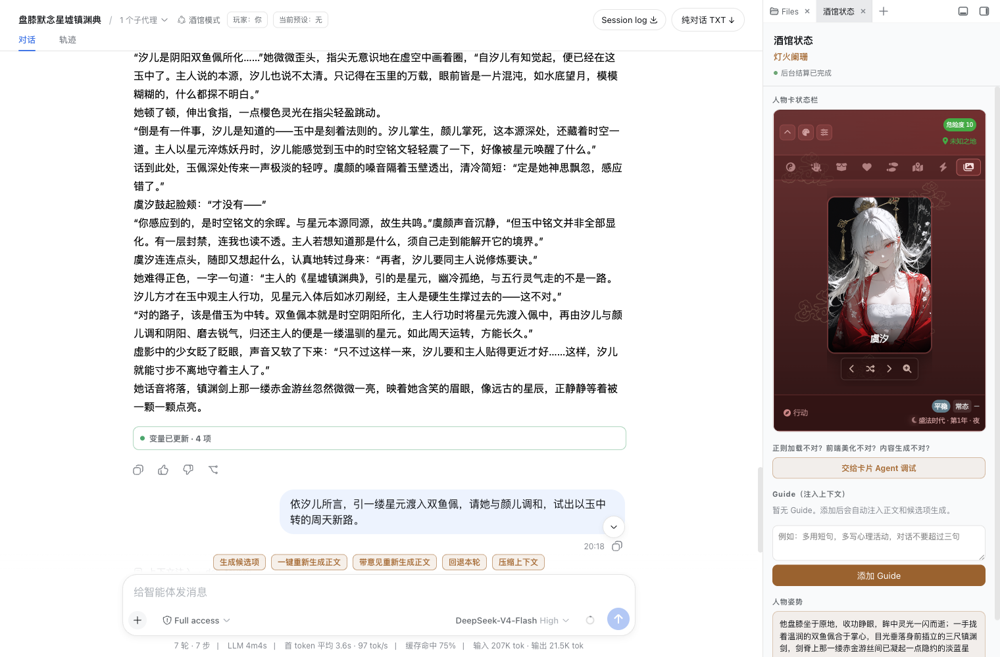

# dsh-tavern

**基于 DeepSeek Harness（DSH）的文字游戏 Agent，支持导入 SillyTavern 人物卡。**

选一张卡自由游玩，或绑定小说、剧本和大纲，让故事沿主线推进。也可以与 Agent 对话，从素材制作新卡，修改人物设定和世界书。

[使用文档](https://flizzywine.github.io/dsh-tavern/) · [入门指南](https://flizzywine.github.io/dsh-tavern/#a02) · [宣传视频](https://www.bilibili.com/video/BV1Bibx61EAC/) · [安装与排错](docs/installation.md) · [Discord 交流](https://discord.com/channels/1134557553011998840/1538577327028445194)


## 可以做什么

- **自由游玩或跟随剧本**：自由输入，也可选择独立生成的行动候选；支持添加持续指导、带意见重写和回退。
- **对话式制作人物卡**：管理人物卡、世界书、预设和剧本，导入时保留原版，讨论确认后修改工作版。
- **使用酒馆人物卡**：支持 PNG / JSON 卡、正则美化、HTML 展示、MVU 后台变量更新和已适配的小手机；第三方脚本的兼容范围取决于具体接口。
- **为剧情配图**：手动生成场景插画，支持带意见重画和查看不同版本；需单独配置生图服务。

导入人物卡即可开始，默认使用内置预设。更多功能、界面截图和公开样例见[功能指南](https://flizzywine.github.io/dsh-tavern/#index)。

## 产品特色

- **无需折腾预设**：导入人物卡即可游玩，默认使用内置预设；通过人物卡或 Guide 调整文风和剧情要求。
- **正文专注讲故事**：候选项和后台状态维护分开处理，减少正文的格式负担；剧本模式可借助原文引导叙事风格，减少模板化表达。
- **速度超快**：一轮交互大约 10 秒，无需超长等待。
- **按需读取上下文**：只读取当前需要的资料，减少无效 Token 消耗。
- **人物卡美化与 MVU**：支持正则美化和 HTML 展示，由后台 Agent 更新 MVU 变量，右侧持续展示状态栏。
- **小手机与正文并排**：在人物卡应用中打开已适配的小手机，边读剧情边查看角色聊天。
- **剧情场景插画**：按当前剧情手动生图，支持带意见重画、版本切换和大图查看；默认关闭，需单独配置生图服务。
- **多平台使用**：支持 Windows、macOS、Linux；Windows 和 macOS 可使用 Desktop，Android 可尝试 DSHA。
- **自由扩展插件**：可自行编写、安装和组合 DSH 插件，更新时保留用户添加的插件与配置。

## 界面展示

### 自由游玩：选择行动，也可以自由输入

正文与候选项分开生成，右侧可查看持续指导和人物姿势。


### 剧本游玩：沿主线推进，保留行动自由

右侧展示剧本进度与本轮参考片段，不必一次塞入整部小说。


### 对话式改卡：边讨论，边修改人物设定

与 Agent 讨论修改内容，同时查看人物卡字段、世界书和绑定剧本。


### MVU：人物状态随剧情变化

后台更新变量，右侧状态栏持续显示，正文下方可查看本轮更新结果。



### 小手机：角色聊天与正文并排展示


### 场景插画：让剧情有画面

插画显示在对应正文下方，点击可查看大图。


## 安装与更新

**为什么锁定 DSH 版本？** DSH 经常进行破坏性更新，DSH Desktop 和 DSHA 也会随之更新内置 DSH，可能导致原本能用的插件在宿主升级后无法运行。为避免用户更新后酒馆失效，本项目必须锁定已适配的 DSH 版本：安装器只接受适配版本，检测到非适配版本会停止安装。请使用下方列出的适配版本，等待本项目完成新版本适配后再升级宿主。

首次安装、更新或重新安装使用同一条命令，保留人物卡、对话和配置。所有平台都要求实际运行的 DSH 为 **`0.1.2-rc.1`**；版本不匹配时停止安装，请使用下方适配版本。

### DSH Desktop（Windows / macOS）

适配版本：**[DSH Desktop 2.0.5](https://github.com/anywhere-labs/dsh-desktop/releases/tag/v2.0.5)**（[历史 Release 下载](https://github.com/anywhere-labs/dsh-desktop/releases)）。必须使用适配版本；检测到非适配 DSH 版本时将停止安装。

安装 Desktop 后，从系统托盘（macOS 菜单栏）打开 **Open DSH Terminal**，运行：

Windows：

```powershell
$env:DSH_TAVERN_HOST='desktop'; $tavernInstaller=[Text.Encoding]::UTF8.GetString((New-Object Net.WebClient).DownloadData('https://cdn.jsdelivr.net/gh/flizzywine/dsh-tavern@main/install.ps1')); Invoke-Expression $tavernInstaller
```

macOS：

```bash
curl -fsSL https://cdn.jsdelivr.net/gh/flizzywine/dsh-tavern@main/install.sh | DSH_TAVERN_HOST=desktop sh
```

完成后重启 Desktop，从托盘的 **Profile** 菜单选择 **tavern**。

### 命令行（Windows / macOS / Linux）

需要 **Node.js 22.19 或更高版本**，无需预装 DSH。安装器使用独立的 DSH `0.1.2-rc.1`，不修改全局 DSH。

Windows PowerShell：

```powershell
$env:DSH_TAVERN_HOST='cli'; $tavernInstaller=[Text.Encoding]::UTF8.GetString((New-Object Net.WebClient).DownloadData('https://cdn.jsdelivr.net/gh/flizzywine/dsh-tavern@main/install.ps1')); Invoke-Expression $tavernInstaller
```

macOS / Linux / WSL2：

```bash
curl -fsSL https://cdn.jsdelivr.net/gh/flizzywine/dsh-tavern@main/install.sh | DSH_TAVERN_HOST=cli sh
```

安装后会自动启动并打开网页。以后使用：

```bash
dsh-tavern open      # 打开网页
dsh-tavern start     # 启动
dsh-tavern stop      # 停止
dsh-tavern restart   # 重启
dsh-tavern update    # 更新
```

首次安装会询问目录：**1 默认目录 `~/.dsh-tavern/`、2 当前目录（回车默认）、3 其他完整路径**。程序、独立运行时和游戏数据存入所选目录；命令入口和 npm/pnpm 缓存可能位于目录外。更新沿用已安装位置；重新运行安装命令时，请在原安装根目录执行，或设置 `DSH_TAVERN_CLI_HOME` 指向原位置。与 Desktop / DSHA 的数据分开，切换安装方式不会自动同步数据。备份、迁移、自定义目录和手动安装见[完整安装说明](docs/installation.md)。

### Android（实验性）

通过 [DSHA](https://github.com/DSH-APP/DSHA) 安装，适配版本：**[1.2.0-rc1.4](https://github.com/DSH-APP/DSHA/releases/tag/v1.2.0-rc1.4)**（[历史 Release 下载](https://github.com/DSH-APP/DSHA/releases)）。必须使用适配版本；检测到非适配 DSH 版本时将停止安装。Android 属于实验性支持，不保证一定可用。

1. **安装 DSHA**：点击上面的适配版本，展开 **Assets**，下载适合手机的 **APK** 并安装（不要下载 Source code）。
2. **先启动一次**：打开 DSHA，配置模型和 API 密钥，确认 DSHA 可以正常启动。
3. **安装酒馆**：打开 DSHA 底部的 **终端**，完整复制下面这一条命令，粘贴后回车，保持 DSHA 打开并等待执行结束。

```bash
node -e "fetch('https://cdn.jsdelivr.net/gh/flizzywine/dsh-tavern@69d74f5/android/setup.sh').then(async r=>{if(!r.ok)throw Error('HTTP '+r.status);require('fs').writeFileSync('/tmp/dsh-tavern-setup.sh',await r.text())}).then(()=>{const r=require('child_process').spawnSync('bash',['/tmp/dsh-tavern-setup.sh'],{stdio:'inherit'});process.exit(r.status??1)}).catch(e=>{console.error(e);process.exit(1)})"
```

4. **进入酒馆**：看到“全部完成”后重启 DSHA，打开底部 **启动** 页 → 点 **启动** → 等待“已就绪，可进入” → 点 **进入** → 从侧栏打开 **酒馆工作台**。
5. **开始游玩**：导入人物卡，选择人物卡开始。如果无法读取 Download 目录，请在 Android 系统设置中允许 DSHA **访问所有文件**，或尝试系统文件选择器。

酒馆工作台现在会在 DSHA 内嵌窗口中打开，顶部提供 **刷新、直接打开、关闭**。遇到白屏或连接问题时，可点 **直接打开** 使用原入口。

**以后打开：DSHA → 启动 → 进入 → 酒馆工作台。** 使用期间保持 DSHA 运行，从这个入口进入即可，无需手动输入浏览器地址。

**更新：**点击酒馆左侧栏底部的 **更新到最新版**；酒馆打不开时，可在 DSHA 的 **酒馆工作台**入口点击 **更新/修复**。安装报错或找不到入口时，见 [Android 安装与排错说明](docs/android-install.md)。

## 开始游玩

1. 在 **设置 → 模型** 中配置模型服务和 API 密钥。
2. 导入人物卡，选择人物卡开始游玩；也可以进入卡片工作台制作新卡。

[完整使用指南](https://flizzywine.github.io/dsh-tavern/)提供详细操作、截图和样例下载，文档网站本身不是在线游戏服务。

## 交流与反馈

欢迎到 [Discord 讨论频道](https://discord.com/channels/1134557553011998840/1538577327028445194)交流使用经验、分享人物卡或反馈问题。需要具备类脑社区成员资格才能进入。

反馈故障时，可从对话顶部的“日志”下载执行记录；分享前请检查其中的对话和附件隐私。
