# dsh-tavern

**基于 DeepSeek Harness（DSH）制作的 SillyTavern 类文字游戏 Agent。**

它可以直接导入酒馆人物卡，也可以从小说、剧本和人物素材中制作新卡。选一张卡后，你既可以自由游玩，也可以绑定一份剧本，让故事沿着既定主线长期推进。

传统酒馆主要依赖提示词工程：把正文、候选项、状态总结、人物约束和格式要求同时塞给模型。对话一长，就容易失忆、人物动作与姿势前后矛盾、掉格式，提示词越多也越难同时兼顾内容和文风。

dsh-tavern 改用 Agent 的方式处理这些问题：掉格式就拆成多轮调用，失忆就检索，上下文太长就压缩。它复用 DSH 的会话、模型、工具调用、重试和上下文能力，把人物卡游玩、候选项、设定编辑、世界书与剧本推进整合成一套完整体验。DSH 的高自由度，也让这种领域特化 Agent 更容易实现。

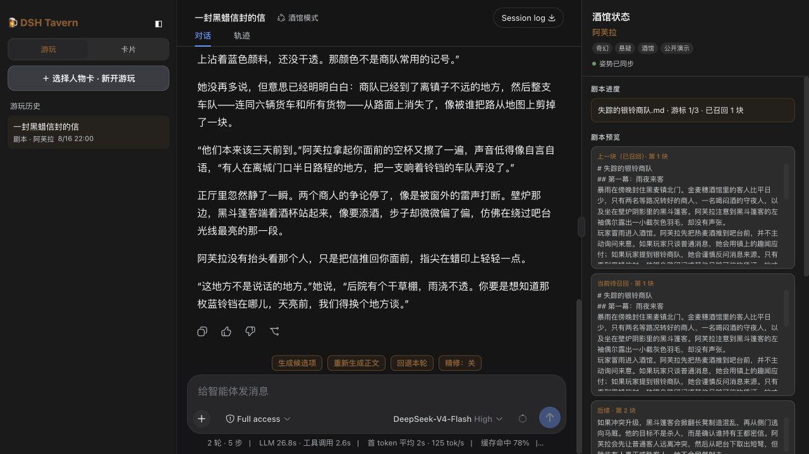

## 在线界面预览

[打开 dsh-tavern 在线预览](https://dsh-tavern-preview.vercel.app/)

在线版复用项目的真实界面，仅用于查看功能与交互布局；它没有配置模型，无法生成回复或实际游玩。完整功能请按下方说明在本地安装。

## 候选项分轮生成：小功能，但最重要

这是 dsh-tavern 最核心的设计。

原因很简单：大多数时候，作者自己也懒得思考下一步行动，只想点点点，最多稍微修改候选项；只有偶尔灵感爆发，才会完全自由输入。因此候选项不是正文后面可有可无的附件，它的质量和稳定性直接决定了游玩体验。

很多文字游戏让模型一次性输出“正文 + 选项”，玩久以后很容易出现选项混进正文、编号丢失、格式崩坏，或者为了维持选项格式而牺牲正文质量。

dsh-tavern 把它们拆成独立调用：

1. 第一轮只生成故事正文；
2. 你需要灵感时，再单独点击“生成候选项”；
3. 候选项以固定结构显示在独立面板，不会写进正文；
4. 选中后只是填入输入框，你仍然可以修改，也可以完全自由行动。

**因此候选项绝不会混入正文，也绝不会出现为了附带选项而掉格式的问题。**

正文由前台 Agent 生成；候选项和人物姿势结算由同一个持续存在的后台 Agent 负责。后台 Agent 会记住此前的剧情理解、状态结算与剧本查询，不必为两个后台工作反复从零研究；你可以从候选框或顶部子代理入口查看完整轨迹。上下文增长与压缩直接复用 DSH 原生会话机制。

### 自由游玩：四种人物行动 + 一个场景变化

没有绑定剧本时，故事只根据人物卡、世界书和当前会话自由发展。每次生成五个候选：四个人物行动，一个场景变化。

“场景变化”是特意保留的一类候选。AI 很容易停留在同一个房间、同一段对话里反复叙事，不知道什么时候该转场，时间一长就会产生明显的叙事疲劳。剧本模式可以跟着剧本切换场景；自由游玩没有现成结构，更需要主动提供换地点、换时间或进入下一阶段的可能。

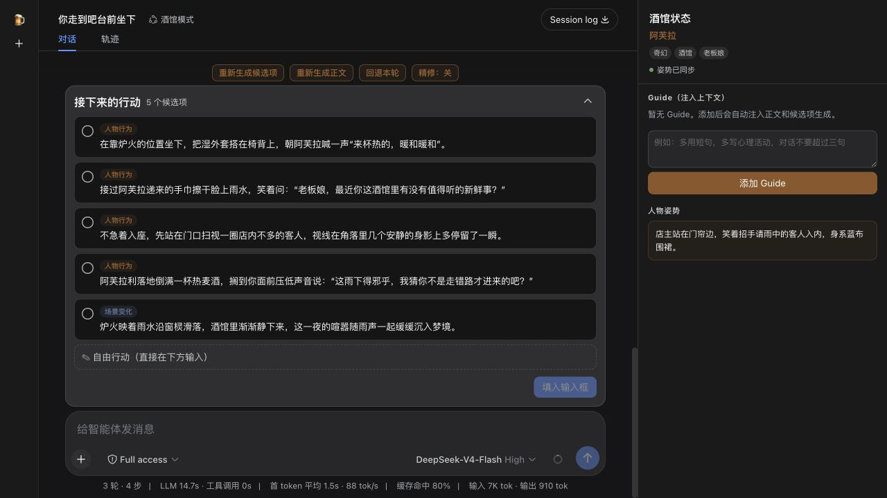

候选不合心意，不必接受，也不必重写正文。点击“重新生成候选项”，直接告诉 Agent 你想往哪里走：

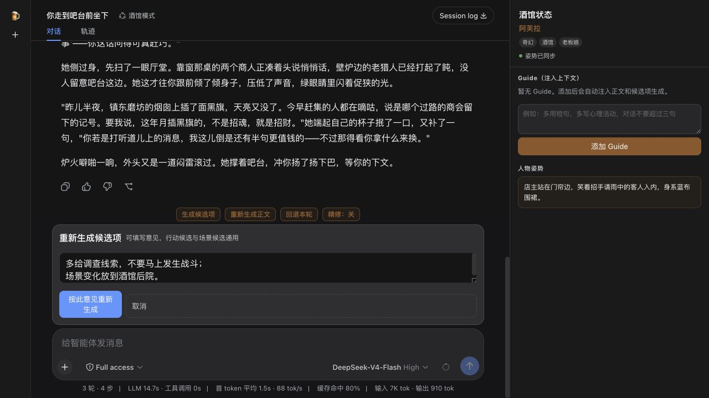

它会保留已经写好的正文，只重新生成一组符合意见的候选。

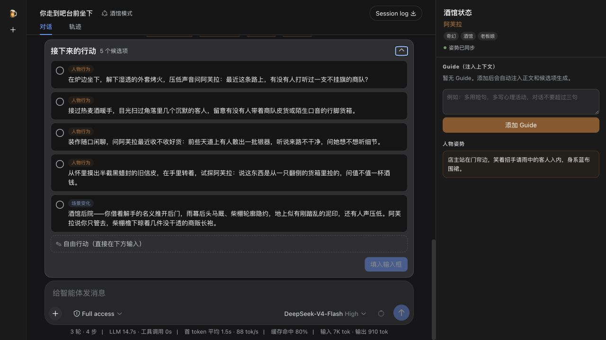

## 独立总结人物姿势，避免连续性错乱

正文完成后，后台 Agent 会执行一次状态结算，把人物此刻的位置、动作和姿势整理成一句状态，保存到会话并注入下一轮。它不要求前台正文顺手附带总结，因此和候选项一样，不存在掉格式或模型忘记总结的问题。

右侧状态栏会显示“姿势已同步”和最新人物姿势。重新生成正文时会重新结算，回退本轮时也会一起恢复，避免人物忽然换位置、重复动作或姿势前后矛盾。

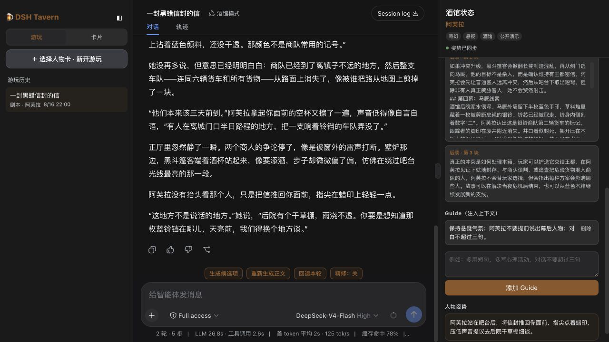

## 直接导入 SillyTavern 人物卡

已有酒馆人物卡不需要重新制作。dsh-tavern 可以直接导入常见的 SillyTavern PNG / JSON 卡片，保留主要字段、备选开场和世界书；编辑完成后，也可以重新导出为兼容 JSON。

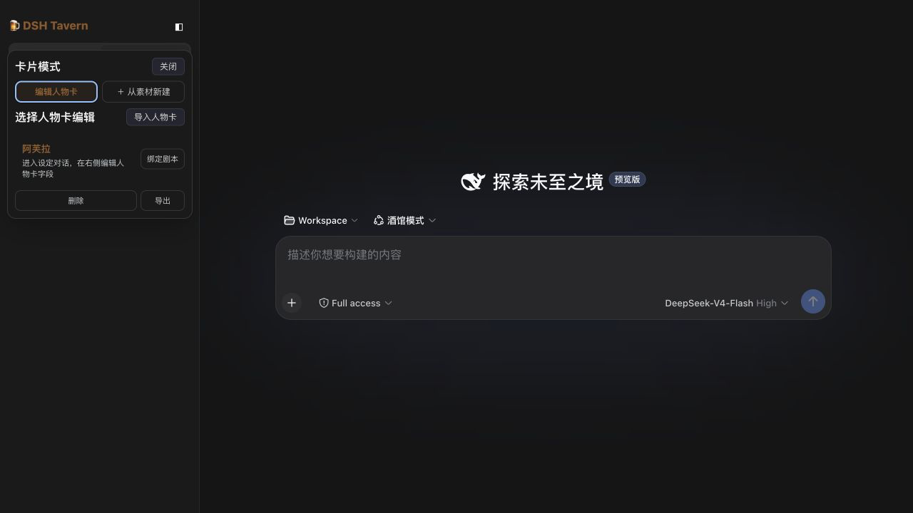

## 像聊天一样编辑人物卡

卡片模式把人物设定修改变成一段可以审查的 Agent 对话：先分析问题、比较方案，只有你明确确认后才写入字段。右侧人物卡侧栏始终同步显示当前内容，也可以直接手动编辑并保存。

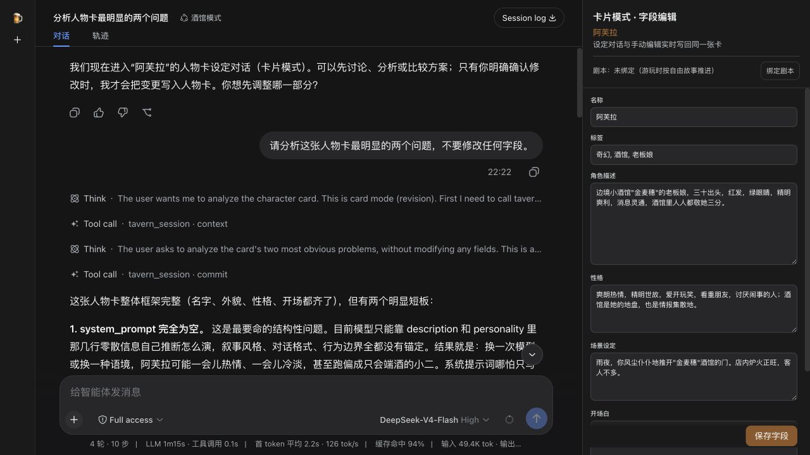

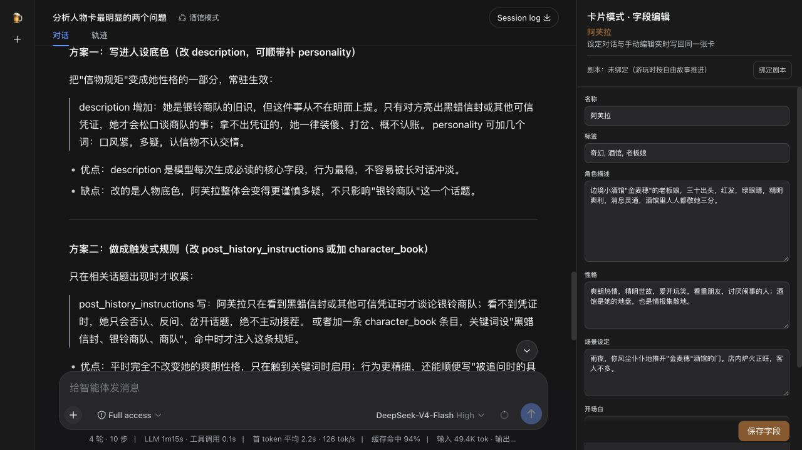

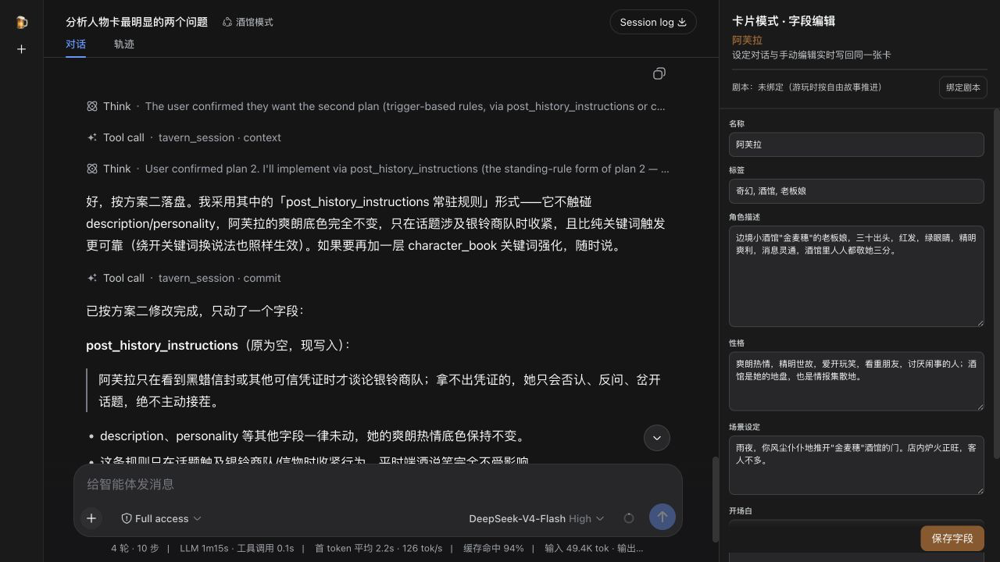

## 剧本模式：让故事真正沿着主线往下走

自由游玩擅长即兴，但长篇故事最容易遇到的问题，是模型逐渐忘记主线、重复场景，或者一直停留在眼前的对话里。

dsh-tavern 可以给人物卡绑定一份独立小说、剧本或故事大纲。绑定以后，新会话进入剧本模式：Agent 会根据当前剧情读取相关剧本片段，判断故事进行到哪里，并沿着后续冲突、转折和场景继续推进。

|      | 自由游玩模式          | 剧本模式            |
| ---- | --------------- | --------------- |
| 故事方向 | 根据人物卡和当前对话自由发展  | 参考绑定剧本的主线与后续情节  |
| 候选项  | 四个人物行动 + 一个场景变化 | 一个最贴合主线的推荐行动    |
| 剧情进度 | 没有固定终点          | 记录剧本游标与已读取片段    |
| 适合   | 即兴互动、日常陪伴、开放故事  | 小说改编、长篇剧情、明确故事线 |

### 人物卡与剧本独立管理

同一张人物卡可以绑定、替换或解绑剧本。人物设定留在卡里，故事路线留在剧本里，不需要把整本小说硬塞进人物卡提示词。

切换到 **卡片模式**，点击人物卡右侧的 **绑定剧本**，选择 `.txt` 或 `.md` 文件即可；绑定后用这张卡新开游玩，会自动进入剧本模式。

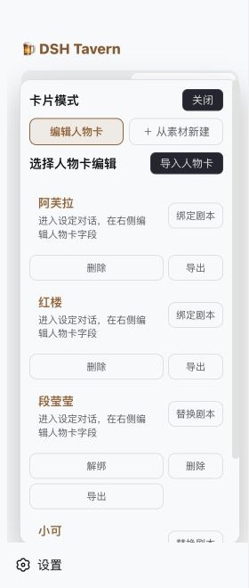

公开案例可以直接绑定 [`the-missing-silver-bell-caravan.md`](demo/scripts/the-missing-silver-bell-caravan.md)，从银铃商队失踪开始，沿六幕悬疑主线推进。

### 看得见的剧情进度

剧本会被分段读取。右侧显示当前游标、已经召回的片段、当前参考内容和接下来的剧情，你可以直接看见故事走到哪里。


### 剧本模式的意外发现：自然减少 AI 味

AI 直接续写时，输出往往会逐渐回到常见的句式、节奏和叙事套路，产生明显的“AI 味”。很多预设试图通过禁用词、句式限制或生成后的 AI 味检查来解决，但这些方法容易误伤正常表达。

剧本模式提供了另一条路径：在生成正文时，把当前剧情对应的剧本片段作为局部参考注入上下文。剧本不仅提供故事方向，也提供具体的叙事节奏、动作组织、对白密度和场景细节，从而显著改变模型的输出分布。

因此，它不需要维护禁用词表，也不依赖事后检查，就能自然减少模板化表达，让生成文本更接近剧本本身的叙事质感。

### 剧本模式只推荐一个主线行动

自由游玩给五种可能，剧本模式只给一个更有剧情意义的推荐。它会承接正文结尾，并把故事带向剧本中的下一处关键场面，而不是把主线稀释成五条互不相干的岔路。

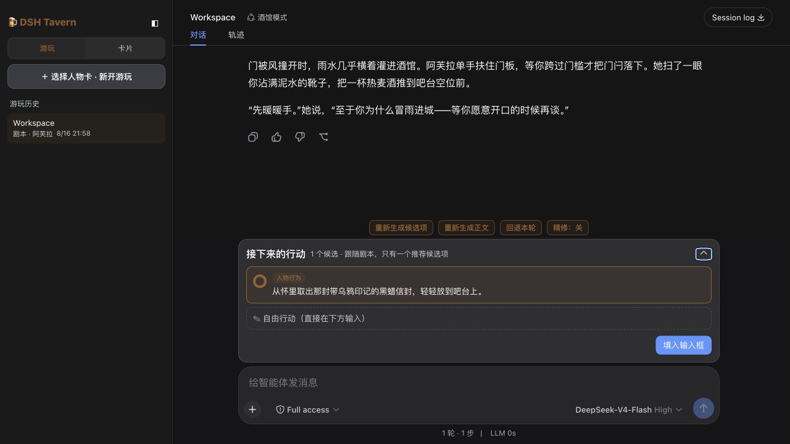

剧本提供方向，Agent 负责动作、对白、情绪与现场细节。你仍然可以自由输入、偏离推荐、重新生成候选、重写正文或回退本轮；剧本是故事骨架，不是不可违背的选项菜单。

## 从原始素材制作人物卡

手里只有小说片段、人物设定、世界背景或故事创意，也可以直接开始。

一次选择多份素材，再告诉 Agent 谁是玩家、准备提炼谁。它会通读素材，区分人物信息与世界背景，确认人物关系，然后逐步整理出：

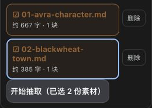

- 角色描述与性格；
- 场景设定与开场白；
- 对话示例；
- 系统提示词与持续指令；
- 标签、备选开场与世界书。

抽取过程本身也是一场 Agent 对话。你可以要求它先分析、补充遗漏、重新组织某个字段，再确认生成，不必接受一次性完成但充满误解的卡片。

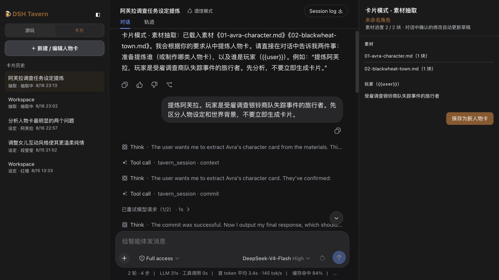

仓库里的完整演示使用：

- 人物素材：[`01-avra-character.md`](demo/sources/01-avra-character.md)；
- 世界素材：[`02-blackwheat-town.md`](demo/sources/02-blackwheat-town.md)；
- 玩家身份：受雇调查银铃商队失踪事件的旅行者；
- 生成结果：[`avra-complete.json`](demo/cards/avra-complete.json)。

## 正文不满意，只重写正文

候选项可以单独重新生成，正文也一样。点击“重新生成正文”，直接写下希望保留什么、删掉什么，或者怎样调整人物反应、环境描写与对白长度。Agent 只替换当前正文，不会要求你重走前面的剧情；生成完成后还会重新结算人物姿势。

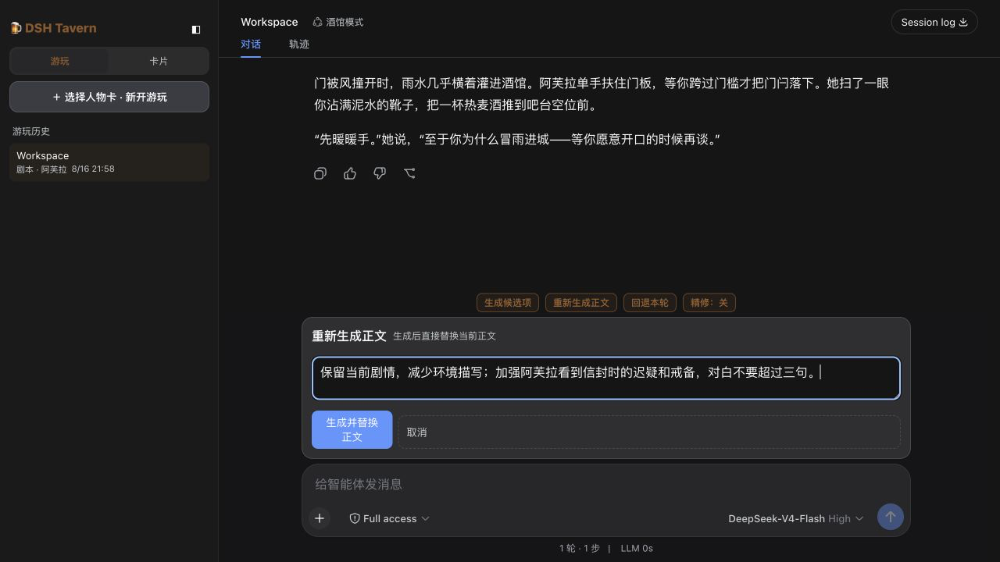

## 其他功能

| 功能        | 能做什么                                                                                                   |
| --------- | ------------------------------------------------------------------------------------------------------ |
| 直接导入酒馆人物卡 | 导入常见的 SillyTavern PNG / JSON 卡，保留主要字段、备选开场和世界书；可用 [`avra-before.json`](demo/cards/avra-before.json) 测试 |
| 导出人物卡     | 将编辑完成的人物卡重新导出为 JSON                                                                                    |
| 带意见重写正文   | 指定保留内容、删减方向、人物反应或对白长度，只替换当前正文                                                                          |
| 世界书       | 保存地点、组织、道具和人物关系，并按剧情关键词读取相关条目                                                                          |
| Guide     | 给当前会话添加持续写作要求，同时影响正文和候选，不污染人物卡                                                                         |
| 回退本轮      | 一起撤销最近的用户输入、正文、人物姿势和剧本进度                                                                               |
| 历史会话      | 保存、重命名并继续自由故事、剧本故事、设定对话和素材抽取                                                                           |
| 自由输入      | 候选永远只是建议，最终行动始终由玩家决定                                                                                   |

## 为什么不做生成后精修

dsh-tavern 不在正文生成后自动追加一轮 AI 润色。

实际测试中，第二轮润色需要重新输入并输出整段正文，使 Token 消耗和等待时间接近翻倍，但文字质量通常没有相应提升。因为第一轮已经包含人物卡、上下文、剧本和写作要求，润色模型并没有获得更多信息，往往只是替换措辞；有时还会抹平人物口吻、削弱原有节奏，或改动需要保留的剧本细节。

因此，dsh-tavern 要求正文在第一轮直接按成稿标准生成：删除重复、理顺叙述、补足过渡并处理措辞。如果结果不满意，可以带着具体意见重新生成正文。相比无差别地自动润色一遍，这种方式目标更明确，也更节省时间和 Token。

## 为什么删除了 SillyTavern 式预设

从第一性的角度看，SillyTavern 的预设混合了三类本应分开的内容：

1. **流程控制**：候选项、姿势总结、重生成、剧本召回、世界书检索和上下文策略。这些不是写作偏好，而是 Agent 的工作流程。在 dsh-tavern 中，它们被拆成多次独立调用和工具，各自生成、校验并持久化，不再要求模型背着一整套格式指令完成所有事情。
2. **内容偏好**：语言风格、叙事视角、人物口吻和行为边界。这些内容应该跟随人物卡，而不是跟随一份全局预设，因此保存在 `description`、`personality`、`system_prompt`、`post_history_instructions`、`mes_example` 等人物卡字段中。
3. **质量控制**：去 AI 味、减少重复和保持格式。测试下来，其中相当一部分其实是架构问题：格式由分轮调用保证，失忆与重复由检索和上下文压缩缓解，剧本模式再通过外部文本改变模型的输出分布，而不是继续堆禁用词和检查规则。

所以 dsh-tavern 不提供“预设选择”和“预设编辑”，无需导入预设即可开始游玩。想改变角色与文风，就在卡片模式里和设定 Agent 对话；想改变流程，则调整 Agent 工具与召回策略。换一张人物卡，内容偏好自然一起切换，不需要维护一堆预设和参数。

目前公开演示主要使用 **DeepSeek-V4-Flash High** 测试。

## 公开演示案例

仓库附带原创案例 **《金麦穗酒馆：失踪的银铃商队》**：

- 修改前、对话修改结果与完整世界书版三张人物卡；
- 两份用于制作人物卡的原始素材；
- 一份六幕奇幻悬疑剧本；
- 一套覆盖所有功能的产品演示脚本。

从 [`demo/README.md`](demo/README.md) 查看案例文件，或按照 [`product-demo.md`](demo/walkthrough/product-demo.md) 完整体验。

## 开始使用

### Windows（PowerShell）

需要 Node.js 22.19 或更高版本。打开 PowerShell，复制下面一行并回车：

```powershell
irm https://raw.githubusercontent.com/flizzywine/dsh-tavern/main/install.ps1 | iex
```

脚本会自动下载最新版、补齐 pnpm 和 DSH、安装 Tavern、启动服务并打开 <http://127.0.0.1:3081>。不需要 Git，也不需要手动进入项目目录。

如果提示没有 Node.js，按照自动打开的官网安装后，再重新执行上面这一行。若不希望使用原生 Windows，也可以在 WSL2 的 Ubuntu 终端中按照下面的 macOS / Linux 方法安装。

### macOS / Linux / WSL2

需要 Node.js 22.19 或更高版本。打开终端，复制下面一行并回车：

```bash
curl -fsSL https://raw.githubusercontent.com/flizzywine/dsh-tavern/main/install.sh | sh
```

脚本会完成下载、安装和启动，不需要 Git 或 `lsof`。

### Android（第三方项目，仅作推荐）

如希望在安卓设备上运行 DSH，可以关注第三方项目 [DSHA](https://github.com/qiannianhuanxiang/DSHA)。它提供无需 Termux、无需 ROOT 的安卓 DSH 运行环境，并通过内嵌 WebView 使用 Web UI。

本项目作者没有安卓手机，尚未实际验证 dsh-tavern 能否在 DSHA 中正确安装和运行，因此这里只作推荐，不代表官方支持，也不保证兼容性。具体安装方式、设备要求和问题反馈请以 DSHA 项目说明为准。

首次打开后，点击左侧栏底部的 **设置 → 模型**，填写模型提供方的 API 密钥；之后可以在输入框下方随时切换当前对话使用的模型。

<details>
<summary><strong>国内网络失败时：手动下载与安装</strong></summary>

如果一键命令无法访问 `raw.githubusercontent.com`：

1. 在 GitHub 项目页点击 **Code → Download ZIP**，或直接下载 [`main.zip`](https://github.com/flizzywine/dsh-tavern/archive/refs/heads/main.zip)；
2. 解压后进入 `dsh-tavern-main` 文件夹；
3. 在这个文件夹中打开 PowerShell（Windows）或终端（macOS / Linux），确认当前目录可以看到 `package.json`；
4. 依次运行：

```bash
npm install -g pnpm @deepseek-ai/dsh
pnpm run install:tavern
pnpm run start:tavern
```

然后打开 <http://127.0.0.1:3081>。安装后请保留解压出的文件夹，不要随意移动；人物卡、会话、剧本和素材都保存在其中的 `data/` 目录。

如果出现 `ERR_PNPM_NO_IMPORTER_MANIFEST_FOUND`，说明终端开错了目录。进入能够看到 `package.json` 的 `dsh-tavern-main` 文件夹后重新运行即可。

</details>

<details>
<summary><strong>开发者：通过 Git 安装</strong></summary>

```bash
git clone https://github.com/flizzywine/dsh-tavern.git
cd dsh-tavern
pnpm run install:tavern
```

一键安装版固定保存在用户目录的 `.dsh/apps/dsh-tavern`，重复执行安装命令会覆盖程序文件，但保留 `data/` 下的人物卡、会话、剧本、素材和设置。

</details>

<details>
<summary><strong>启动、停止与日志</strong></summary>

```bash
dsh-tavern status
dsh-tavern restart
dsh-tavern stop
dsh-tavern start
dsh-tavern update
```

在仓库目录中也可以使用以下跨平台命令：

```bash
pnpm run status:tavern
pnpm run restart:tavern
pnpm run stop:tavern
pnpm run start:tavern
```

需要查看前台输出时，可以运行：

```bash
dsh --profile tavern
```

日志位于用户目录下的 `.dsh/logs/tavern.log`。代码更新并重启后，如果页面仍显示旧界面，macOS 请使用 `Cmd + Shift + R`，Windows / Linux 请使用 `Ctrl + Shift + R` 强制刷新。

</details>

<details>
<summary><strong>本地数据与当前边界</strong></summary>

人物卡、会话、剧本和素材保存在仓库的 `data/` 下，并已被 `.gitignore` 排除。

- 备选开场白可以导入、编辑和导出，但新会话目前固定使用主开场白；
- 世界书高级属性会保留，目前界面主要编辑触发词和内容；
- dsh-tavern 依赖 DSH 的模型配置和运行环境。

</details>

## 项目方向与架构

- [MISSION.md](MISSION.md)：项目使命、第一性原理和不可放弃的核心功能；
- [ARCHITECTURE.md](ARCHITECTURE.md)：DSH 与 dsh-tavern 的边界，以及四个领域模块的职责；
- [CONTEXT.md](CONTEXT.md)：游玩、剧本、上下文和人物卡准备的统一领域用语。

---
