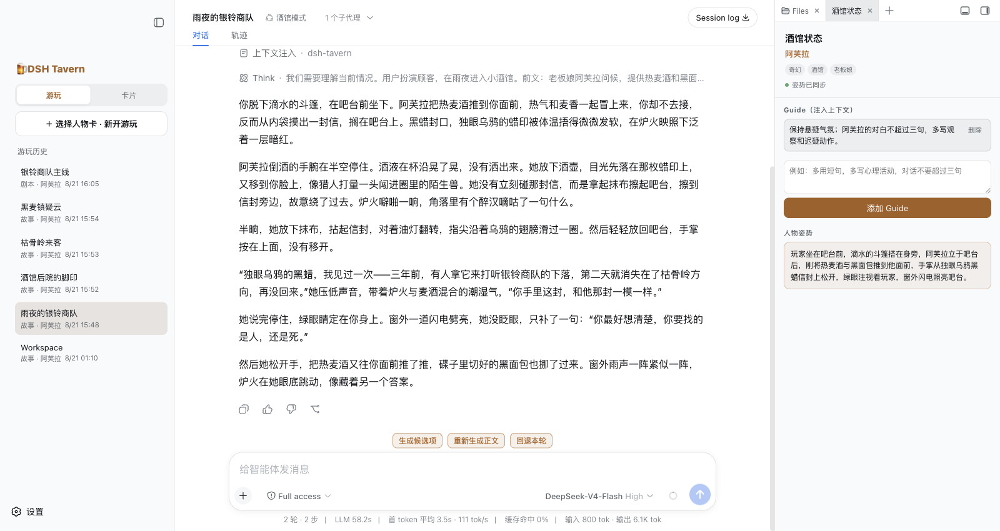
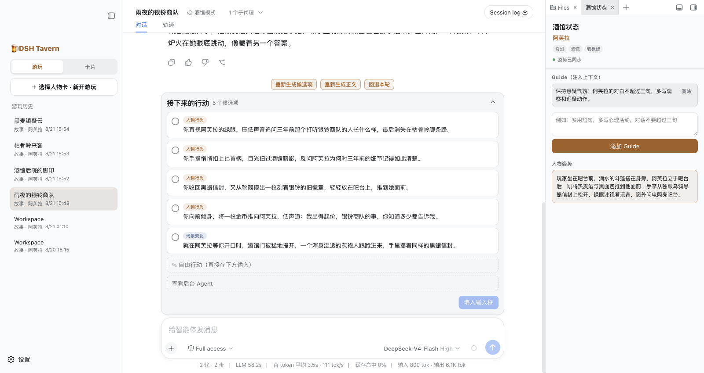
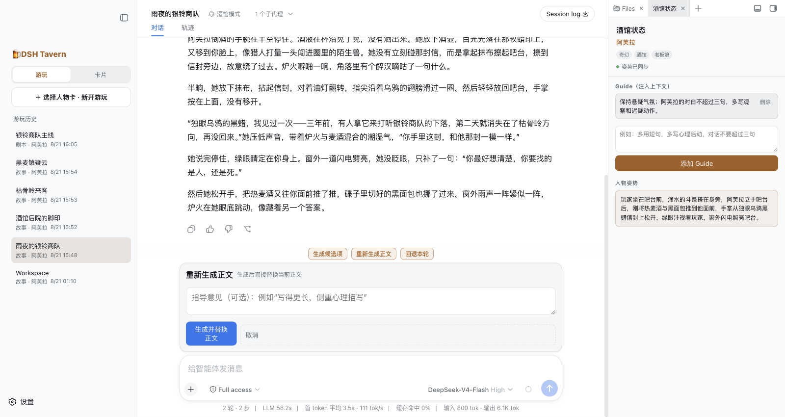
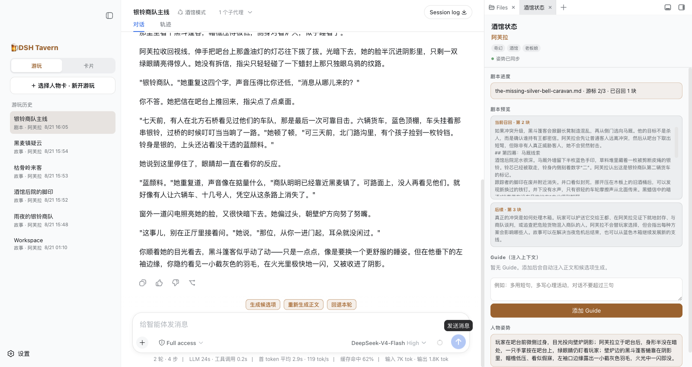
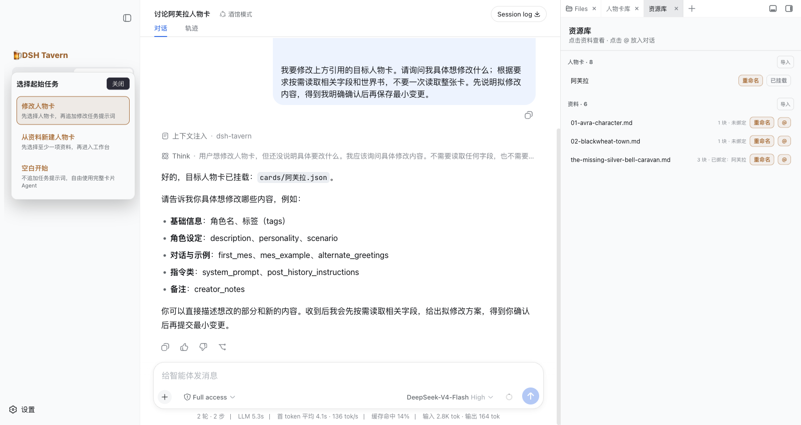
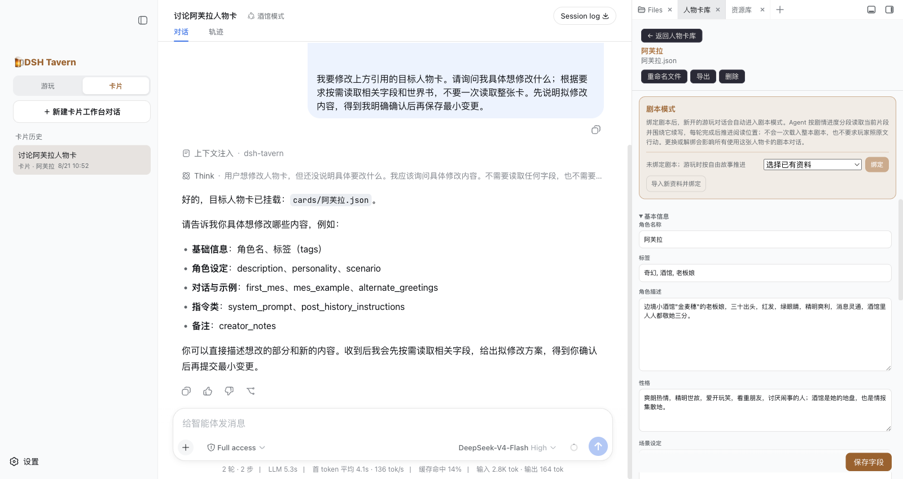

# dsh-tavern

**基于 DeepSeek Harness（DSH）制作的 SillyTavern 类文字游戏 Agent。**

它可以直接导入酒馆人物卡，也可以从小说、剧本和人物素材中制作新卡。选一张卡后，你既可以自由游玩，也可以绑定一份剧本，让故事沿着既定主线长期推进。

传统酒馆主要依赖提示词工程：把正文、候选项、状态总结、人物约束和格式要求同时塞给模型。对话一长，就容易失忆、人物动作与姿势前后矛盾、掉格式，提示词越多也越难同时兼顾内容和文风。

dsh-tavern 改用 Agent 的方式处理这些问题：通过拆分提示词，隔离不同类型的生成任务，让模型集中注意力在特定任务上，提升输出质量。它复用 DSH 的会话、模型、工具调用、重试和上下文能力，把人物卡游玩、候选项、设定编辑、世界书与剧本推进整合成一套完整体验。



## 产品功能

### 1. 游玩模式

#### 自由游玩

自由游玩不受固定剧情限制，故事会根据人物卡、世界书和当前对话自然发展。

正文与候选项分开生成。正文只负责讲好故事，候选项则提供多种人物行动和场景变化，不会混入正文。玩家可以直接选择、修改候选，也可以完全自由输入。

自由游玩还支持：

- 独立总结人物姿势，保持人物位置、动作和状态前后一致；
- 注入 Guide，为当前会话添加持续生效的剧情或写作要求；
- 输入意见，重新生成候选项；
- 输入意见，重新生成正文；
- 回退当前回合。

#### 剧本游玩

剧本模式可以为人物卡绑定小说、剧本或故事大纲，让剧本作为故事主线持续牵引剧情。

每一轮只参考当前剧情附近的剧本内容，不会一次性把整份剧本塞给模型。系统会记录当前剧情进度，并根据后续情节推荐更贴近主线的行动。

同时玩家保留偏离剧本的自由。

### 2. 卡片模式

卡片模式用于制作、理解和维护人物卡、素材与剧本。

你可以像聊天一样，让 Agent 先阅读人物卡，分析其中的问题，讨论不同修改方案。只有在你确认之后，Agent 才会把修改写入人物卡。

卡片模式支持：

- 导入和导出 SillyTavern PNG / JSON 人物卡；
- 保留并编辑人物卡中的世界书；
- 通过对话分析、讨论和修改人物卡；
- 从素材中提炼新人物卡；
- 管理人物卡使用的素材和绑定剧本；
- 查看、修改、替换素材与剧本，使其符合自己的故事构想。

人物卡负责“角色是谁”，素材负责“创作依据是什么”，剧本负责“故事往哪里走”。三者彼此独立，又可以在同一个卡片工作流程中组合使用。

### 3. 产品特色

#### 无需导入预设

直接导入人物卡，即可开始游玩

#### 支持 Android 手机（实验性，不保证一定可用）

借助 [DSHA](https://github.com/qiannianhuanxiang/DSHA)，可以尝试在 Android 手机上部署和运行 dsh-tavern。目前手机端的后台保活、界面适配和运行稳定性仍不完善，具体操作与限制见下方 Android 安装说明。

#### 速度快、消耗低

dsh-tavern 只在需要时注入必要上下文，并把不同任务拆成短而明确的调用，减少无效的 Token 消耗和等待时间。

使用 DeepSeek V4 Flash 测试时，一轮交互平均等待时间约为 15 秒。

#### 文本质量高，AI味少

dsh-tavern 使用尽可能少而精的提示词，把流程和状态交给程序管理，把文字创作留给模型。

减少不必要的格式要求、禁用词和提示词堆叠，保护并激发模型的文字创造力，剧本模式通过剧本文字引导，可以改变模型的文本输出分布，极大压制AI味。

### 界面展示

#### 自由游玩：正文与候选项分开生成

候选项独立展示人物行动与场景变化；右侧可同时查看 Guide 和人物姿势。



#### 带意见重新生成正文

不满意当前正文时，可以补充指导意见后重新生成并替换。



#### 剧本游玩：围绕主线持续推进

右侧展示当前剧本进度、召回片段与人物姿势，正文仍保留玩家自由行动的空间。



#### 卡片工作台

可以修改现有人物卡、从资料新建人物卡，或空白开始；资料可从右侧资源库挂载。



#### 对话式编辑人物卡

在中间与 Agent 讨论修改内容，同时在右侧查看并编辑人物卡字段、世界书与绑定剧本。



## 安装与启动

需要 Node.js 22.19 或更高版本。

### Windows

打开 PowerShell，运行：

```powershell
irm https://raw.githubusercontent.com/flizzywine/dsh-tavern/main/install.ps1 | iex
```

### macOS / Linux / WSL2

打开终端，运行：

```bash
curl -fsSL https://raw.githubusercontent.com/flizzywine/dsh-tavern/main/install.sh | sh
```

安装程序会自动安装依赖、启动 dsh-tavern，并打开 <http://127.0.0.1:3081>。

首次使用时，在左侧栏底部打开 **设置 → 模型**，填写模型服务的 API 密钥。

### 手动下载代码包

如果一键命令无法访问 `raw.githubusercontent.com`：

1. 在 GitHub 项目页点击 **Code → Download ZIP**，或直接下载 [`main.zip`](https://github.com/flizzywine/dsh-tavern/archive/refs/heads/main.zip)；
2. 解压后进入 `dsh-tavern-main` 文件夹；
3. 在这个文件夹中打开 PowerShell（Windows）或终端（macOS / Linux），确认当前目录可以看到 `package.json`；
4. 如果尚未安装 `pnpm` 或 DSH，先运行：

```bash
npm install -g pnpm @deepseek-ai/dsh
```

5. 安装并启动 dsh-tavern：

```bash
pnpm run install:tavern
pnpm run start:tavern
```

然后打开 <http://127.0.0.1:3081>。

### Android（实验性，不保证可用）

借助 [DSHA](https://github.com/qiannianhuanxiang/DSHA)，可以尝试在 Android 手机上运行本项目：

1. 前往 DSHA 仓库下载并安装 APK；
2. 在 DSHA 中添加模型 API；
3. 打开“创造模式”，把 dsh-tavern 仓库地址发给 AI，让它完成部署：

```text
https://github.com/flizzywine/dsh-tavern
```

还可以让 AI 安装 `<mobile-adapt>` 插件，改善手机屏幕适配。

目前 Android 端仍有较多问题：

- 必须保持 DSH 在后台运行，否则无法访问 3081 端口的酒馆模式；
- 终止 DSH 进程后，3080 端口的启动器可以重新拉起，但 3081 端口的酒馆模式需要通过命令或让 AI 再次启动；
- 手机界面和运行稳定性尚未完善。

### 启动、停止与更新

安装完成后，新开一个终端或 PowerShell。

启动：

```bash
dsh-tavern start
```

停止：

```bash
dsh-tavern stop
```

重启：

```bash
dsh-tavern restart
```

更新：

```bash
dsh-tavern update
```
