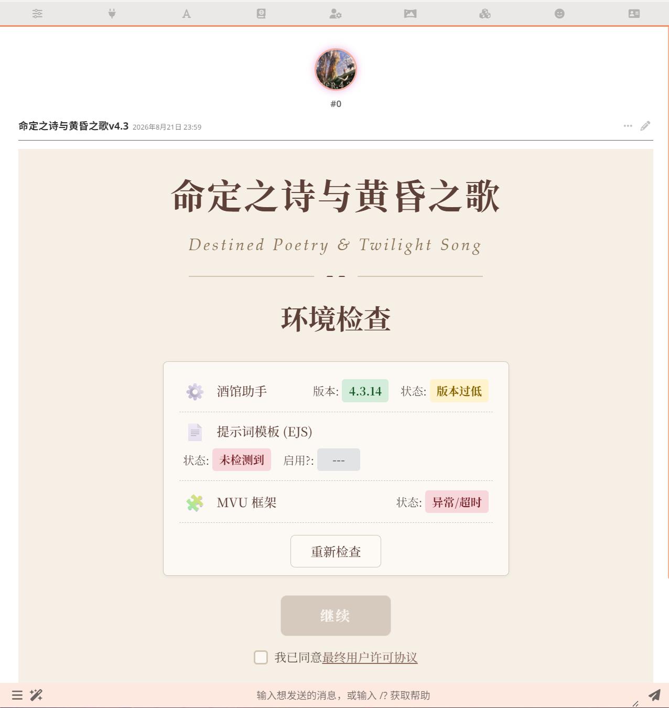
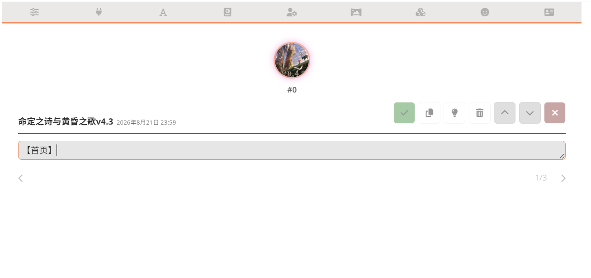
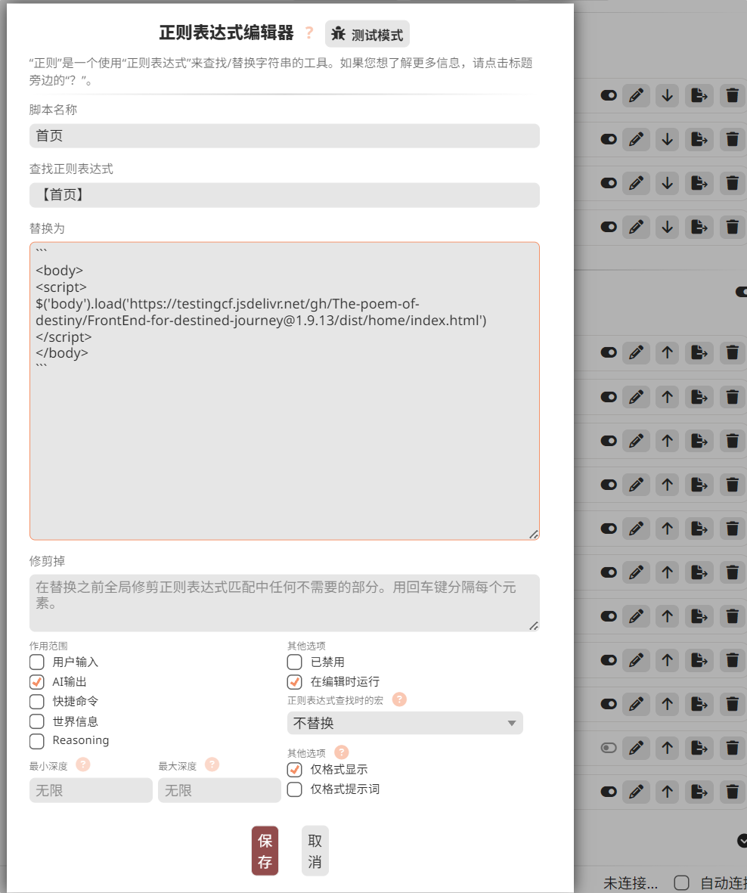
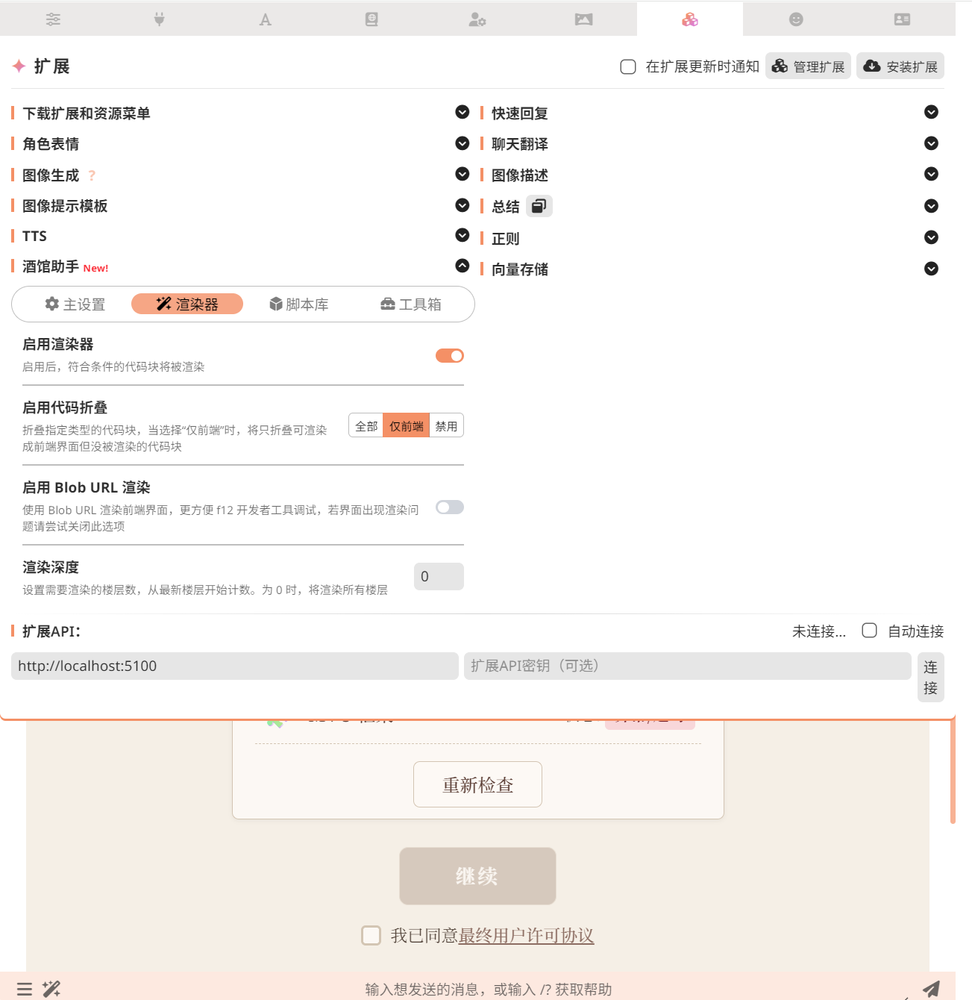

# 酒馆正则如何把 `【首页】` 变成可交互卡片

> 记录日期：2026-08-25  
> 案例：命定之诗与黄昏之歌 v4.3  
> 源码基线：SillyTavern `release@8172dcd`；酒馆助手 `main@4dd4b87`

## 一句话结论

`【首页】` 不是卡片本身，而是一个容易识别的占位符。酒馆正则先把它替换成前端代码；酒馆助手的渲染器再把前端代码放进 `iframe` 中运行，最终才得到可以点击的卡片。

```text
原始消息【首页】
  → 正则匹配【首页】
  → “替换为”产出前端代码块
  → 酒馆把代码块格式化到消息页面
  → 酒馆助手识别前端代码块
  → iframe 渲染成可交互卡片
```

这里有两个独立步骤，不能混为一谈：

- **正则负责改写文本**，不负责渲染界面。
- **酒馆助手负责运行前端代码**，把代码变成真正的界面。

## 正则的三个关键部分

### 1. 查找正则表达式

它回答“要找什么”。简单时可以直接匹配固定文字，例如 `【首页】`；复杂时也可以用捕获组、前后条件等正则语法匹配一类内容。

酒馆最终调用 JavaScript 的字符串替换；`$1`、`$2` 和命名捕获组可以在“替换为”中引用匹配结果。对应源码见 [SillyTavern 正则执行器](https://github.com/SillyTavern/SillyTavern/blob/8172dcd0ee672d3cd9a5e5f7af134f91a45cd2b8/public/scripts/extensions/regex/engine.js#L391-L435)。

### 2. 替换为

它回答“找到以后换成什么”。替换结果可以只是普通文字，也可以是一段代码。

本例把 `【首页】` 替换为一个带 `<body>` 和 `<script>` 的前端代码块；脚本再从 jsDelivr 加载“命定之诗”的首页文件。代码的具体内容不是理解机制的重点，重点是：**原消息只保存了短占位符，较长的界面代码由正则在显示时生成。**

### 3. 作用范围

它回答“这条规则在哪些内容、哪个阶段、哪些楼层生效”。在当前酒馆源码中，实际由四组条件共同决定：

| 条件 | 含义 | 本例设置 |
| --- | --- | --- |
| 内容位置 | 用户输入、AI 输出、快捷命令、世界信息或 Reasoning | 只勾选 **AI 输出** |
| 处理阶段 | 仅格式显示、仅格式提示词，或常规处理 | 勾选 **仅格式显示** |
| 编辑状态 | 编辑消息时是否仍运行 | 勾选 **在编辑时运行** |
| 楼层深度 | 只处理距离最新消息一定范围内的楼层 | 最小、最大深度均为无限 |

酒馆先判断显示阶段或提示词阶段，再检查编辑状态、深度和消息位置，全部符合才执行规则。对应源码见 [作用范围判断](https://github.com/SillyTavern/SillyTavern/blob/8172dcd0ee672d3cd9a5e5f7af134f91a45cd2b8/public/scripts/extensions/regex/engine.js#L334-L380)、[消息显示阶段](https://github.com/SillyTavern/SillyTavern/blob/8172dcd0ee672d3cd9a5e5f7af134f91a45cd2b8/public/script.js#L1785-L1813)和[提示词阶段](https://github.com/SillyTavern/SillyTavern/blob/8172dcd0ee672d3cd9a5e5f7af134f91a45cd2b8/public/script.js#L4442-L4448)。

本例的“仅格式显示”尤其重要：它表示规则用于消息的显示投影，而不是把聊天记录里的原始正文永久改写成前端代码。因此平时看到的是卡片，进入正文编辑时仍可能看到 `【首页】`。这不是丢失内容，而是“原文”和“显示结果”分开保存。

## 用“命定之诗”走一遍

### 图一：平时看到的是可点击卡片



此时看到的已经是整条处理链的最终结果，不是聊天文件里的原始正文。

### 图二：编辑正文时看到 `【首页】`



`【首页】` 是保存下来的短文本，也是正则的触发标记。这样做可以让聊天正文保持简洁，同时由显示规则决定最终界面。

### 图三：正则把 `【首页】` 换成前端代码



这条规则的逻辑可以直译为：

```text
如果 AI 输出里出现【首页】
并且当前正在格式化消息以供显示
就把【首页】替换成指定的前端代码块
```

正则执行到这里，得到的仍然只是代码文本。酒馆把 Markdown 代码块转换成页面中的 `<pre><code>`，但不会因为正则替换本身就自动得到图一。

### 图四：酒馆助手渲染代码块



酒馆助手开启“渲染器”后，会在消息中寻找符合条件的代码块。目前它以代码是否包含 `html>`、`<head>` 或 `<body` 来识别前端内容，然后读取代码块正文，生成 `iframe` 的 `srcdoc` 或 Blob URL。对应源码见 [前端代码识别](https://github.com/N0VI028/JS-Slash-Runner/blob/4dd4b873f191accb5dd933089ddf36b846458585/src/util/is_frontend.ts)、[消息代码块查找](https://github.com/N0VI028/JS-Slash-Runner/blob/4dd4b873f191accb5dd933089ddf36b846458585/src/store/iframe_runtimes/message.ts)、[iframe 创建](https://github.com/N0VI028/JS-Slash-Runner/blob/4dd4b873f191accb5dd933089ddf36b846458585/src/panel/render/Iframe.vue#L38-L49)和[完整 HTML 组装](https://github.com/N0VI028/JS-Slash-Runner/blob/4dd4b873f191accb5dd933089ddf36b846458585/src/panel/render/iframe.ts#L78-L103)。

于是，前端代码里的 HTML、CSS、JavaScript 真正开始工作，远程首页被加载进来，最终形成图一的交互卡片。

## 快速排查表

| 正则 | 酒馆助手渲染器 | 通常会看到什么 |
| --- | --- | --- |
| 关闭 | 开启或关闭 | 原始占位符 `【首页】` |
| 开启 | 关闭 | 替换后的前端代码块 |
| 开启 | 开启 | 渲染后的交互卡片 |
| 开启 | 开启，但远程资源失败 | 空白、报错或加载不完整的卡片 |

如果显示不对，可以按顺序检查：原文是否真有触发词、正则是否匹配、作用范围是否包含当前消息、替换结果是否是前端代码块、渲染器是否开启、远程资源是否可访问。

## dsh-tavern 的权威兼容基线

本备忘是 dsh-tavern 正则展示与前端渲染的机制基线：

1. 原始消息、发给模型的提示词、给用户看的显示结果应当分开，不能互相污染。
2. 正则是文本投影规则；前端渲染是后续能力，应作为两个模块分别处理。
3. 单条正则或单个界面加载失败，不应破坏原始聊天和整轮会话。
4. 前端代码和远程资源具有执行风险。酒馆助手虽然使用 `iframe` 承载界面，但当前组件没有设置 `sandbox` 属性，不能把它当成严格的安全沙箱；只应运行可信来源的代码。

dsh-tavern 在该机制上做一项明确扩展：除酒馆助手能识别的完整前端代码围栏外，标注为 `html` / `htm` 的围栏和正文 raw HTML 也在原位置渲染。实现仍使用 opaque-origin iframe，不照搬酒馆助手的无 `sandbox` 权限。

正式数据结构和安全边界见[助手正文 HTML 渲染设计](../design/inline-message-renderer-refactor.md)；三层正则语义见[正则三层语义备忘](../design/regex-three-layer.md)。
